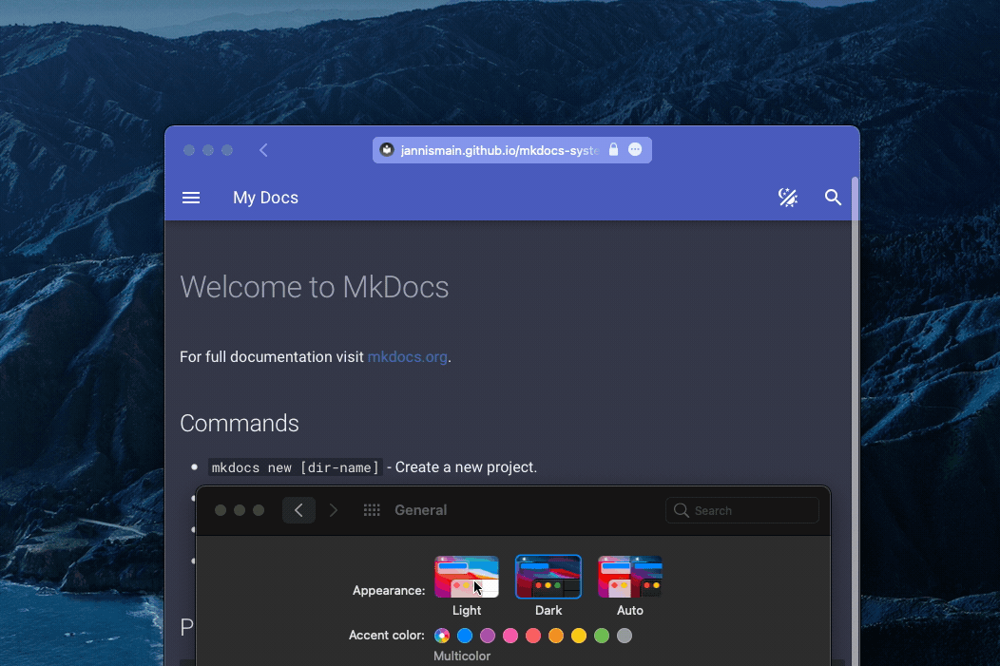
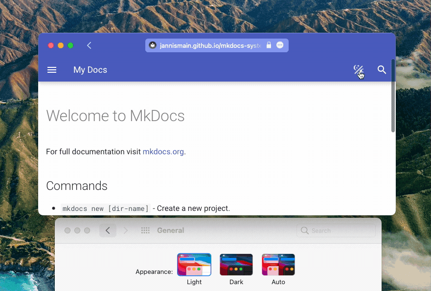

[Live Demo](https://jannismain.github.io/mkdocs-system-preference-theme-toggle/)

A demonstration of a custom palette toggle for [mkdocs-material](https://squidfunk.github.io/mkdocs-material/) that has an option to follow the system preference:

## Reference

* [mkdocs-material#3123](https://github.com/squidfunk/mkdocs-material/issues/3123)
* [pymdownx documentation](https://facelessuser.github.io/pymdown-extensions/): @facelessuser did it first (and probably using a more robust implementation). However, he was overriding the header completely and using a custom palette toggle altogether. This implementation uses the palette toggle provided by mkdocs and extends it's behavior, which means no need to override the template.
